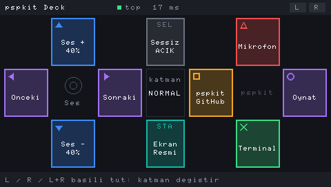

# pspkit (çalışma adı)

PSP'yi masanda gerçekten iş gören bir kontrol paneline çevirir. PSP'yi USB ile Linux PC'ye ya da Raspberry Pi'a takarsın, XMB'den uygulamayı açarsın, çalışır.

**İlk uygulama: Deck.** PSP'de çalışan bir Stream Deck. Özellikleri:
- Her karo bir fiziksel tuşa bağlı.
- L/R ile 4 katman, toplamda 40 aksiyon.
- Analog çubuk ses seviyesi ya da kaydırma için kullanılabiliyor.
- Karolarda canlı durum görünüyor: mikrofon kapalı mı, şu an ne çalıyor, OBS'te hangi sahne açık.
- Karolar masaüstü uygulamasından ayarlanıyor.

Sonra **Printer** (3D yazıcı paneli) gelecek, ardından Media, MIDI ve Dev.



> **Durum: Deck MVP.** PPSSPP'de uçtan uca çalışıyor ve 21 testi var. Gerçek PSP'de USB testi henüz yapılmadı ([docs/m0.md](docs/m0.md)).

## Hızlı başlangıç

PC tarafını kur (Linux; `python3-yaml`, `python3-pyside6`, `python3-dbus` gerekir):

```bash
scripts/install.sh
```

PSP uygulamasını derle ([pspdev](docs/m0.md) gerekir). Çıktı `psp/apps/deck/dist/PSP` klasörüne gelir, bu klasörü hafıza kartının köküne kopyala:

```bash
make deck
```

Kurulumu kontrol et:

```bash
pspkit doctor
```

Karoları ayarlamak için uygulama menüsünden "pspkit Deck"i aç ya da:

```bash
pspkit-deck
```

Ayrıntılar: **[docs/deck.md](docs/deck.md)**

## Depo

| Klasör | İçerik |
|---|---|
| `psp/libpspkit/` | PSP ortak kütüphanesi: USB/TCP taşıma, satır protokolü, çift tamponlu çizim |
| `psp/apps/deck/` | Deck PSP uygulaması (EBOOT) |
| `psp/m0/` | M0 bağlantı testi |
| `bridge/pspkit/` | PC köprüsü (Python, sadece stdlib + PyYAML): oturumlar, aksiyonlar, uinput, MPRIS, PipeWire, OBS |
| `desktop/` | PySide6 ayar uygulaması |
| `scripts/` | Kurulum betiği, udev kuralı |
| `third_party/psplinkusb` | usbhostfs (BSD-3), submodule |

Tasarım: [docs/designs/pspkit-design.md](docs/designs/pspkit-design.md). İş planı: [TODOS.md](TODOS.md).

## Geliştirme

Köprü testlerini çalıştırmak için:

```bash
make test
```

PSP olmadan denemek için Deck'i PPSSPP'de aç (köprü çalışıyor olmalı):

```bash
make ppsspp
```

Tuşa basmayı simüle etmek için:

```bash
pspkit sim normal cross
```

PSP ekran görüntüsü almak için:

```bash
pspkit shot
```
