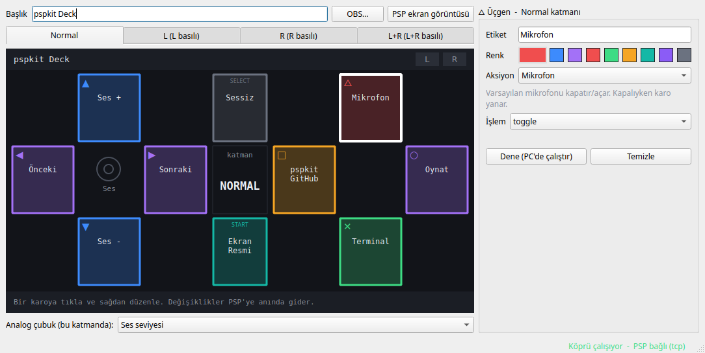

# pspkit Deck

PSP'yi Stream Deck'e çeviren uygulama. PSP monitörünün altında durur, USB kablosuyla PC'ye bağlanır, her tuşa bir iş atarsın: klavye kısayolu, komut, medya, ses, mikrofon, OBS.


## Nasıl çalışır

```
PSP (Deck EBOOT) ──USB──► usbhostfs_pc ──localhost:10004──┐
PPSSPP / Wi-Fi ───TCP─────────────────────localhost:10200──┴► pspkit köprüsü ──► klavye, ses, medya, OBS
                                                                   ▲
                                        pspkit Deck (masaüstü) ────┘  deck.yaml
```

- **PSP uygulaması** sadece ekranı çizer ve tuşları bildirir. Aksiyon ve ayar bilgisi PSP'de tutulmaz.
- **Köprü** (`pspkit`) PC'de arka planda çalışan bir servis. Ayarları `~/.config/pspkit/deck.yaml`'dan okur ve aksiyonları çalıştırır. Canlı durumu (mikrofon kapalı mı, şu an ne çalıyor, aktif OBS sahnesi) saniyede bir PSP'ye gönderir.
- **Masaüstü uygulaması** (`pspkit-deck`) `deck.yaml`'ı düzenler. Kaydettiğin an PSP ekranı güncellenir.

## Kurulum

### 1. PC tarafı (bir kere)

```bash
scripts/install.sh
```

Bu betik şunları yapar:
- `pspkit` ve `pspkit-deck` komutlarını kurar.
- Oturum açılınca otomatik başlayan köprü servisini (`systemctl --user status pspkit-bridge`) kurar.
- Uygulama menüsüne "pspkit Deck" girişini ekler.

Kaldırmak için `scripts/install.sh --uninstall`.

PSP'nin USB ile bağlanabilmesi için bir kerelik bir udev kuralı gerekir. Kural cihaza sadece oturum açan kullanıcının erişmesine izin verir (`uaccess`):

```bash
sudo cp scripts/udev/60-pspkit-psp.rules /etc/udev/rules.d/ && sudo udevadm control --reload-rules
```

Her şeyin hazır olup olmadığını kontrol etmek için:

```bash
pspkit doctor
```

### 2. PSP tarafı

CFW gerekir: ARK-4, PRO ya da LME. Derlemek için:

```bash
make deck
```

Ardından `psp/apps/deck/dist/PSP` klasörünü hafıza kartının köküne kopyala. Kartta `PSP/GAME/pspkit_deck/` klasörü oluşur, içinde `EBOOT.PBP` ve `usbhostfs.prx` bulunur.

### 3. Kullan

PSP'de **Oyun → Memory Stick → pspkit Deck**'i aç ve kabloyu tak. Uygulama önce USB'yi dener. 15 saniye içinde köprü bulunamazsa TCP'ye geçer.

## PSP'de kullanım

| Ne | Nasıl |
|---|---|
| Aksiyon çalıştır | Karonun üzerindeki tuşa bas (△ ○ ✕ □, d-pad, START, SELECT) |
| Katman değiştir | L, R ya da ikisini birden basılı tut. 4 katman × 10 tuş = 40 aksiyon |
| Analog çubuk | Katmana göre ses seviyesi ya da kaydırma (ayarlanabilir) |
| Çıkış | HOME |

Üst barda bağlantı türü (usb/tcp) ve son basışın gidiş-dönüş süresi görünür. Hatalar (örneğin "OBS'e bağlanılamadı") alt barda kırmızı gösterilir.

## Masaüstü uygulaması



- Önizlemede bir karoya tıkla, sağdan etiket, renk ve aksiyon seç. Etikette `|` alt satır demek.
- **Dene** aksiyonu hemen PC'de çalıştırır, PSP'ye gerek yok.
- **PSP ekran görüntüsü** PSP ekranını köprü üzerinden PNG olarak kaydeder (`~/Pictures/pspkit/`).
- `deck.yaml`'ı elle de düzenleyebilirsin. Hem köprü hem uygulama değişikliği görür. Bozuk bir dosya kaydedersen köprü önceki ayarı kullanmaya devam eder ve hatayı PSP'de gösterir.

## Aksiyonlar

Tam liste parametreleriyle birlikte `pspkit actions` komutunda.

| Aksiyon | Ne yapar | Karoda canlı durum |
|---|---|---|
| `key` | Tuş kombinasyonu, örn. `ctrl+shift+t`, `super`, `print`. X11 ve Wayland'de `/dev/uinput` ile çalışır | - |
| `command` | Kabukta komut çalıştırır | - |
| `open` | URL, dosya ya da klasör açar (`xdg-open`) | - |
| `media` | Çalan oynatıcıyı kontrol eder: oynat/duraklat, ileri, geri, durdur (MPRIS: Spotify, tarayıcı, VLC...) | Çalan parçanın adı |
| `volume` | Ses +/−, sessiz | Ses yüzdesi / sessiz |
| `mic` | Mikrofonu kapat/aç | Kapalıyken karo yanar |
| `obs` | Sahne değiştirme, kayıt, yayın, kaynak sesini kapatma | Aktif sahne, REC, CANLI |

**OBS:** OBS'te **Araçlar → WebSocket Sunucu Ayarları**'ndan sunucuyu aç. Şifreyi masaüstü uygulamasındaki **OBS...** düğmesinden gir.

**Klavye düzeni:** Tuş adları fiziksel tuş konumlarını gösterir (ABD düzeni). Türkçe Q klavyede kısayollar aynı fiziksel tuşlara denk gelir.

## Kablo olmadan deneme (PPSSPP)

```bash
flatpak install flathub org.ppsspp.PPSSPP
```

PPSSPP'de **Ayarlar → Ağ → WLAN**'ı aç. Köprü çalışırken şunu çalıştır:

```bash
make ppsspp
```

Bu komut Deck'i PPSSPP'nin hafıza kartına kopyalar ve başlatır. Kopyalanan `tcp.cfg` dosyası USB denemesini atlatır.

Tuşa basmadan test etmek için:

```bash
pspkit sim normal cross
```

Ekran görüntüsü için:

```bash
pspkit shot
```

## Sorun giderme

- **Ne olursa olsun önce:** `pspkit doctor`. Her sorun için ne yapılacağını söyler.
- **Köprü logları:** `journalctl --user -u pspkit-bridge -f`
- **PSP'de "Kopru baglantisi yok":** Köprü çalışıyor mu (`pspkit status`)? USB için udev kuralı kurulu mu? `lsusb | grep 054c:01c9` PSP'yi gösteriyor mu?
- **Kısayollar çalışmıyor:** `pspkit doctor` `/dev/uinput` iznini kontrol eder ve düzeltme komutunu verir.

## Gizlilik ve güvenlik

- Köprü TCP'yi varsayılan olarak sadece `127.0.0.1`'de dinler. Wi-Fi için `pspkit run --host 0.0.0.0` açıkça verilmelidir.
- `usbhostfs_pc` PSP'ye bir `host0:` dosya sistemi de sunar. Köprü ona boş bir klasör (`~/.local/share/pspkit/host0`) verir, PSP senin dosyalarını göremez.
- Kontrol soketi `$XDG_RUNTIME_DIR/pspkit/bridge.sock` sadece senin kullanıcına açık (0600).
