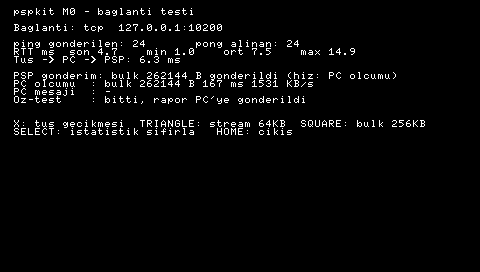

# M0: USB testi (PSP ↔ PC)

Bu test, bütün mimarinin dayandığı soruyu cevaplıyor: **PSP, USB üzerinden PC'deki bir Python programıyla konuşabiliyor mu, ne kadar hızlı?**

```
PSP (pspkit_m0 EBOOT)  ──USB, kanal 4──►  usbhostfs_pc  ──localhost:10004──►  tools/m0/echo.py
```

## Bir kerelik kurulum (PC)

1. pspdev toolchain `~/pspdev` altında kurulu. Her yeni terminalde şunu çalıştır ya da `~/.bashrc`'ye ekle:

   ```bash
   export PSPDEV=~/pspdev PATH=~/pspdev/bin:$PATH
   ```

2. usbhostfs_pc'nin root olmadan USB'ye erişebilmesi için udev kuralını kur:

   ```bash
   sudo cp ~/pspdev/share/psplinkusb/50-psplink.rules /etc/udev/rules.d/ && sudo udevadm control --reload-rules
   ```

   Bu adımı atlarsan `usbhostfs_pc`'yi `sudo` ile çalıştırman gerekir.

## Derleme

Repoyu yeni klonladıysan önce submodule'ü indir:

```bash
git submodule update --init
```

Sonra derle:

```bash
make -C psp/m0 dist
```

Çıktı `psp/m0/dist/PSP/GAME/pspkit_m0/` altına gelir: `EBOOT.PBP` ve `usbhostfs.prx`. EBOOT, `usbhostfs.prx`'i kendi klasöründen yükler, o yüzden ikisi aynı klasörde durmalı.

## PSP'ye kopyalama

1. PSP'yi XMB'de **Ayarlar → USB Bağlantısı** ile PC'ye bağla (ya da hafıza kartını kart okuyucuya tak).
2. `psp/m0/dist/PSP` klasörünü hafıza kartının köküne kopyala, yani `PSP/GAME/pspkit_m0/` oluşsun.
3. USB bağlantı modundan çık. Kablo takılı kalabilir.

## Testi çalıştırma

1. PSP'de **Oyun → Memory Stick → "pspkit M0 USB test"** uygulamasını aç. Ekranda `PC bekleniyor` yazısını görmelisin.
2. PC'de 1. terminal:

   ```bash
   usbhostfs_pc
   ```

   `Connected to device` benzeri bir satır görmelisin. PSP ekranında da `USB bagli` yazmalı.
3. PC'de 2. terminal (repo kökünde):

   ```bash
   python3 tools/m0/echo.py
   ```

4. PSP ekranında ping sayısı ve RTT (gidiş-dönüş süresi) artmaya başlar.

| PSP'de | Ne ölçer |
|---|---|
| ✕ (Asya modelinde ○) | Tuş → PC → PSP süresi. Deck hedefi 100ms'den az. |
| △ | 64KB'ı async kanaldan gönderir (küçük mesaj yolu). |
| □ | 256KB'ı bulk yoldan gönderir (kamera/görüntü yolu). |
| SELECT | İstatistikleri sıfırlar. |
| HOME | Çıkış. |

`echo.py` terminaline bir şey yazıp Enter'a basarsan PSP ekranında **PC mesajı** satırında görünür. Bu da PC'den PSP'ye yönü test eder.

## Bana geri bildirmen gerekenler

- PSP ekranının fotoğrafı: RTT değerleri, tuş gecikmesi, △ ve □ hızları.
- `usbhostfs_pc` ve `echo.py` terminallerinin çıktısı.
- CFW adı ve sürümü (ARK-4 / PRO / LME, örneğin `6.61 ARK-4`).

## Bir şey ters giderse

- **Ekranda `HATA: <adım> -> 0x...` görünüyorsa,** adımın adını ve kodu bana gönder.
  - `kuKernelLoadModule -> 0x80010002`: dosya bulunamadı. `usbhostfs.prx` EBOOT'la aynı klasörde değil.
- **Uygulama hiç açılmadan XMB'ye dönüyorsa ya da siyah ekranda donuyorsa,** M0'ın asıl sorusu cevaplanmış olur, sadece olumsuz yönde. İki olası sebep var:
  1. CFW'de `KUBridge` yok.
  2. Sonradan yüklenen `usbhostfs.prx`'in kütüphanesine user-mode'dan bağlanılamıyor.

  Bu durumda plan B küçük bir kernel PRX yazmak. Bana CFW sürümünü söylemen yeterli.
- **`PC bekleniyor` ekranında kalıyorsa,** `usbhostfs_pc` terminalinde hata var mı bak. `lsusb | grep 054c` komutu `054c:01c9` göstermeli. Göstermiyorsa PSP USB'yi aktive edememiş demektir, ekranda `sceUsbActivate` satırının kodunu gönder.
- **RTT görünmüyor ama USB bağlı görünüyorsa,** `echo.py` çalışıyor mu, `localhost:10004`'e bağlandı mı kontrol et.

## Kablo olmadan: PPSSPP ile test (M0b)

PPSSPP USB donanımını emüle etmez. Uygulama açılınca yine önce USB'yi dener; PPSSPP KUBridge'i destekler ve `usbhostfs.prx`'i gerçekten yükler, ama PC tarafı hiç bağlanmadığı için 15 saniye sonra USB'yi kapatıp **TCP**'ye geçer: `127.0.0.1:10200`. `tcp.cfg` dosyası (EBOOT'un yanında, içinde `<ip> <port>`) USB'yi atlayıp doğrudan TCP'ye zorlar.

Bir kerelik kurulum:

```bash
flatpak install flathub org.ppsspp.PPSSPP
```

PPSSPP'de Wi-Fi emülasyonunu aç: **Ayarlar → Ağ → WLAN'ı etkinleştir**. Ya da `~/.var/app/org.ppsspp.PPSSPP/config/ppsspp/PSP/SYSTEM/ppsspp.ini` dosyasında `[Network]` altına `EnableWlan = True` ekle.

Çalıştırmak için 1. terminalde köprüyü başlat:

```bash
python3 tools/m0/echo.py --listen
```

2. terminalde PPSSPP'yi aç:

```bash
make -C psp/m0 ppsspp
```

`make ppsspp` EBOOT'u PPSSPP'nin kendi hafıza kartına kopyalar (Flatpak'teki PPSSPP ev dizinini salt-okunur görüyor) ve başlatır. Uygulama 10 pong'dan sonra **otomatik öz-test** yapar: tuş gecikmesi, stream ve bulk ölçümü. Raporu köprü terminaline `OZ-TEST RAPORU` satırı olarak yazar.

**Ekran görüntüsü:** köprü terminaline `/shot` yazıp Enter'a bas, ya da `--shot-after 12` seçeneğini kullan. PSP ekranı köprü üzerinden `shots/psp-*.png` olarak kaydedilir. Bu gerçek PSP'de de çalışır.



İlk PPSSPP sonuçları (1.20.4, 2026-09-28). Emülatör zamanlaması gerçek donanımı temsil etmez; bu ölçüm sadece mantığın uçtan uca çalıştığını kanıtlıyor:

| Ölçüm | Değer |
|---|---|
| Ping RTT | min 1.0 ms, ortalama 1.5-7 ms, max 15 ms |
| Tuş → PC → PSP | 5.8-6.3 ms |
| Stream 64KB (PC ölçümü) | ~1400 KB/s |
| Bulk 256KB (PC ölçümü) | ~1530 KB/s |
| Ekran görüntüsü (522KB) | ~360 ms |
